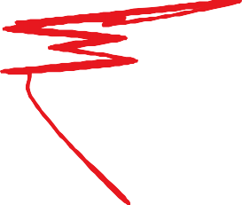
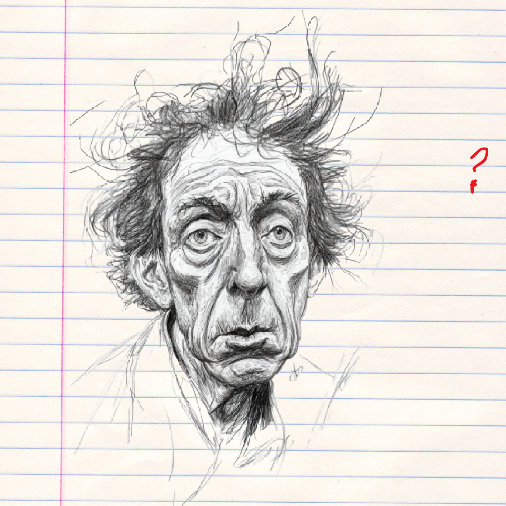
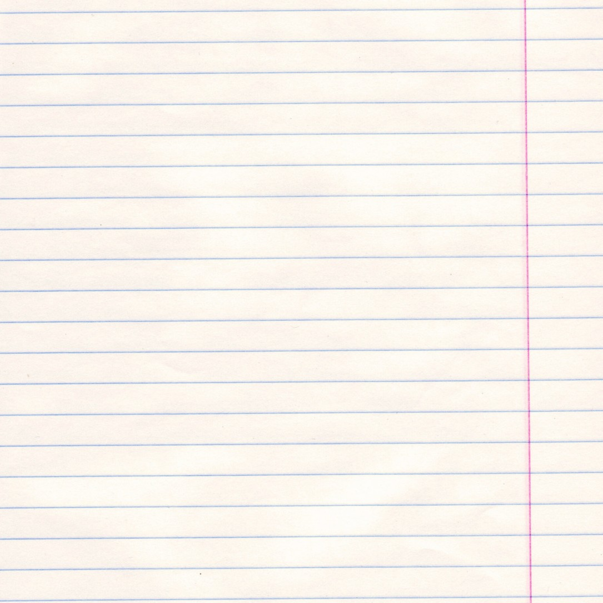
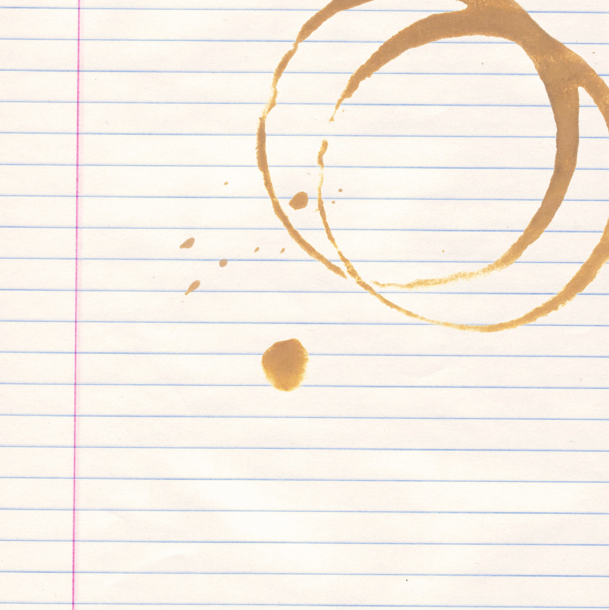
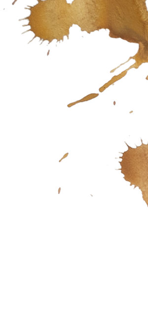
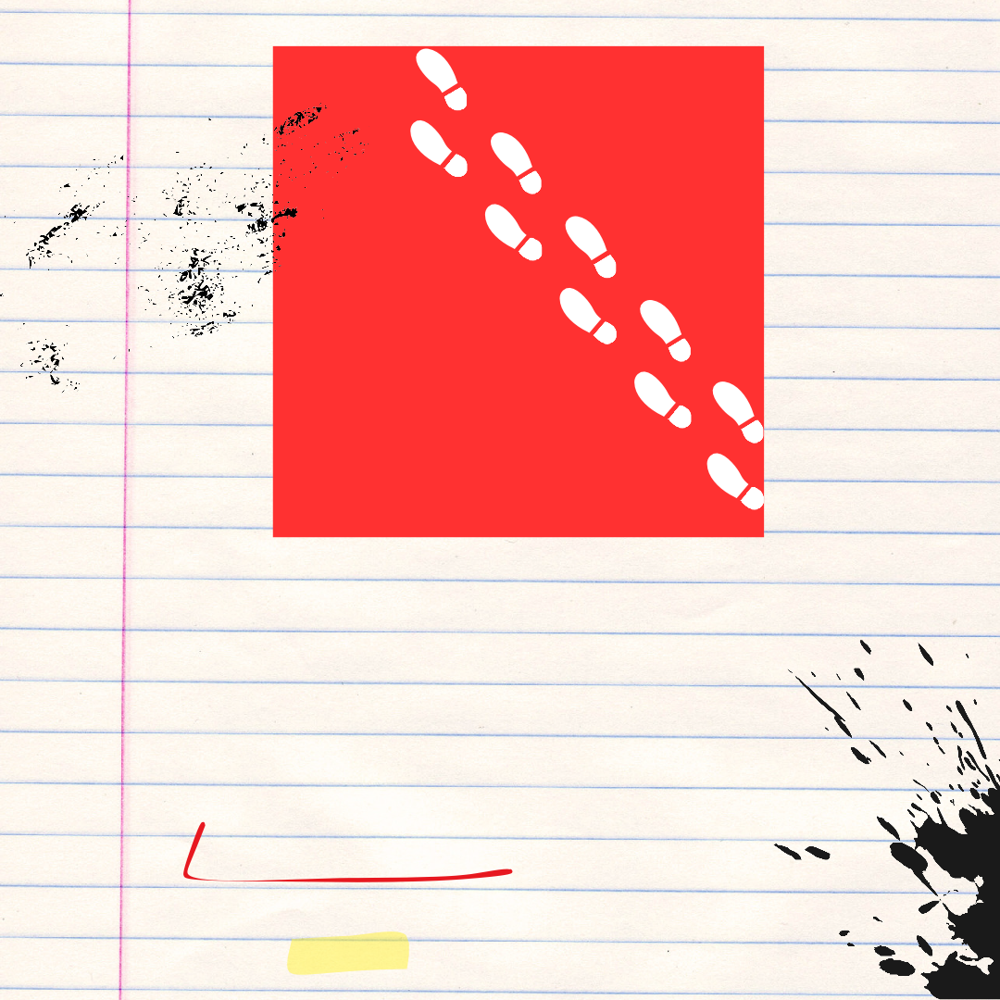
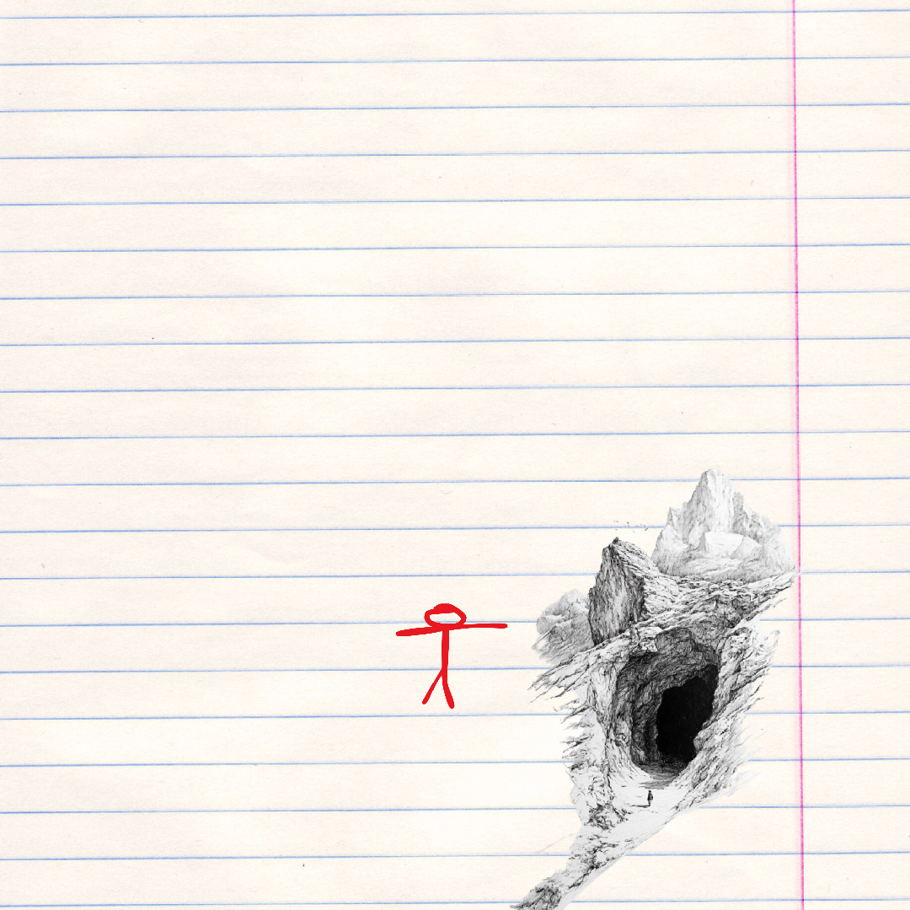
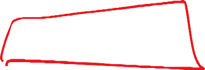
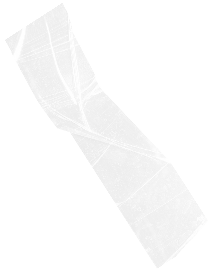

Notes Rafała - AI Devs 3

Nie powinienem był tego robić.
Obsługa skomplikowanego
sprzętu, niekoniecznie będąc
trzeźwym, to nie był dobry
pomysł. I ta pizza w ręce.
Źle się czuję. Nie wiem, jak
bardzo będę tego żałował.
Może po prostu prześpię się
i wszystko wróci do normy.
Z jednej strony wiedziałem,
czego się spodziewać
i wiedziałem, że ta maszyna
może przenosić w czasie, a z
drugiej strony do dziś dnia
nie mogę uwierzyć, że jestem
w 20... roku. To nienormalne!

To Jestem normalny. ię
napr wszystko dzieje s lny.
T awdę. Jestem norma.
J o jest rzeczywistość ,
g estem normalny. Wiem .
dzie jestem i kim jestem
w Jestem normalny. To t
no szystko w koło. To jes y.
rmalne. Jestem normaln
Mam na imię Rafał. Jestem
normalny. Świat jest
nienormalny.

aSpotkałem Azazela, ę
przprzynajmniej tak siek.
edstawił ten człowi
z prz Twierdzi, że jest ał mi
o yszłości. Opowiad .
dziwnych rzeczachede
mn wierzę mu. Nikt prz ie!
Nie
ą nie cofnął się w czas
Ale on wiedział o wszystkim,
prnad czym pracowałem z u
ofesorem Majem. Dałem m
badania, które zabrałem
z laboratorium.

Dlaczego Adam wybrał akurat
ten rok? Według jego wyliczeń,
wtedy powinniśmy rozpocząć
pracę nad technologią LLM, aby
wszystko wydarzyło się
n zgodnie z planem. Mówił, że ,
a ajpierw musi powstać GPT-2
lupotem GPT-3, które zachwycą
dzkość. Później będzie z górki.
On wie, co robi.
Co z badaniami zrobił Azazel?

No i powstało GPT-2.
Słyszałem w wiadomościach,
a to wszystko dzięki badaniom,
które dostarczyłem. Wszystko
dzieje się tak szybko!
Czy ja właśnie pisze nową
historię? TAK! Zmieniam świat
i widzę efekty tych zmian.
JESTEM Z TEGO DUMNY!
TAK!

W idealnym momencie zjawiłem
się w Grudziądzu. Wszystko
zadziało się jak w szwajcarskim
zegarku. Perfekcyjnie!
Tylko dlaczego akurat
Grudziądz? To nie ma większego
sensu. Może ONI wybrali to
miejsce losowo? Nie ma tutaj
drugiego dna?
Tylko kto jest mózgiem tej misji?
Adam, czy Azazel?
Wrócę?
RAV

Czekają mnie dwa lata bardzo
intensywnej nauki. Adam mówi,
że tyle potrzebuje na wchłonięcie
szkolenia, które przygotował.
m Ponoć w przyszłości, dziękidą
odelom językowym, ludzie bę
w stanie to zrozumieć w nieco
ponad pięć tygodni. Nie chce mi
się w to wierzyć.
Ja póki co uczę się obsługi modeli
językowych, aby móc pomóc
profesorowi.

Co ja zrobiłem?
bo jeden był dobry, ale nie ten co
go wybrałem? może ja nie ratuję
wcale świata?
po której stronie jestem?

Zmieniłem się.
Wszystko się zmieniło.
Wszystko się miesza.
Świat się zmienił.
Nikt mnie już nie pozna.
Sam się nie poznaję.
Tyle lat odosobnienia.
W co ja się wpakowałem?
Który mamy rok?
When am I?

Nie da się żyć z tą wiedzą.
Wspierając demony sam stajesz
się demonem?
A gdyby to wszystko zakończyć?
Przecież znam przyszłość.
Pomogłem Andrzejowi,
ale oni mnie
wykorzystali.

Śniły mi się drony nad miastem.
Te, które znałem z opowieści Adama.
On mówił, że po 2024 roku tak
będzie wyglądać codzienność.
Ja mu wierzę, ale skrycie nie chcę,
aby to co mówi, było prawdą.
Może ta przyszłość nigdy
nie nadejdzie?

Byłem na przesłuchaniu i pytali
o Andrzeja. No to powiedziałem,
co wiedziałem. I nie wiem, jak to
się dalej potoczy. Siedzę tu już
dostatecznie długo, żeby
wszystko przemyśleć. Wiem
teraz więcej niż wcześniej.
I
nie chodzi o wiedzę techniczną.
Wszystko sobie poukładałem.
Te demony czekały na odkrycie.

OPowinni Barbarę przesłuchać.
na wie wszystko. Rozmawiałem
z nią.
Moje przypuszczenia były
w słuszne. Miesza mi się
de szystko, ale wiem kto jest
monem, kto człowiekiem, a kto
Otarobotem. Widzę demony.
czają nas. Z jednym niegdyś
pracowałem.
Może czas na egzorcyzmy?

{{FLG:
}}
Poszedłem na spacer. Ochra ziemia pod stopami.,
a w koło las, skały i śnieg.
Szedłem prosto. Obróciłem się w lewo i znów
prosto. Kolejny zwrot w lewo i później znów
prosto. Zatrzymałem się i obróciłem w prawo
c tym razem. To wszystko wykonałem
ztery razy i początek stał się końcem.
TSpojrzałęm na swoje białe ślady na śniegu.
o było miejsce w którym chciałbym teraz być.

Iz 2:19
Znalazłem miejsce
schronienia. Tutaj nikt
mnie nie znajdzie.
To miejsce nie jest
szczególnie oddalone od
miasta, w którym
spędziłem ostatnie lata.
Zatrzymam się tu na
jakiś czas.
Trochę tu zimno i ciemno,
ale bezpiecznie.

Na spotkanie z demonem
trzeba się przygotować.
Spojrzeć prosto w oczy
i wyrecytować mu jego
grzechy.
Czy on wie, żę jest zły?
czy on stanie się złym?
Co za różnica, gdy za
chwilę wszystko będzie
bez znaczenia?

Andrzejek... Andrzejek...
słyszę w głowie Twoje
kroki i czekam na Ciebie.
To już jutro.
Kiedyś ja pomogłem Tobie,
a dziś Ty pomożesz
światu.
Trzeba wszystko
odwrócić.
11 listopada 2024
# Zdjęcia odnalezionych fragmentów strony

