# Notatki Rafała - AI Devs 3

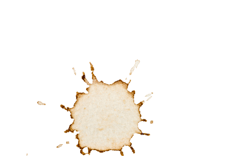

Nie powinienem był tego robić. Obsługa skomplikowanego sprzętu, niekoniecznie
będąc trzeźwym, to nie był dobry pomysł. I ta pizza w ręce. Źle się czuję. Nie
wiem, jak bardzo będę tego żałował. Może po prostu prześpię się i wszystko wróci
do normy.

Z jednej strony wiedziałem, czego się spodziewać i wiedziałem, że ta maszyna
może przenosić w czasie, a z drugiej strony do dziś dnia nie mogę uwierzyć, że
jestem w 20... roku. To nienormalne!

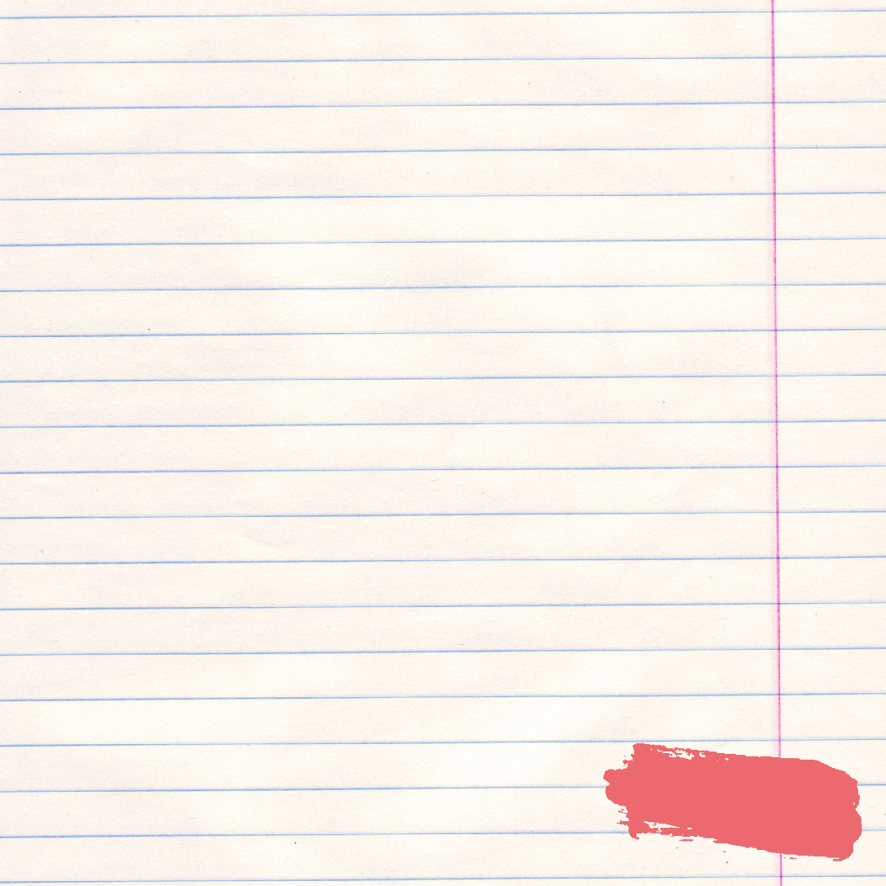

To jestem normalny. Wszystko dzieje się w porządku. Jestem normalny. To jest
rzeczywistość, jestem normalny. Wiem, gdzie jestem i kim jestem. Jestem
normalny. To wszystko wkoło. To jest normalne. Jestem normalny.

Mam na imię Rafał. Jestem normalny. Świat jest nienormalny.

Spotkałem Azazela, przynajmniej tak się przedstawił ten człowiek. Twierdzi, że
jest z przyszłości. Opowiadał dziwne rzeczy, a ja mu wierzę. Nikt przecież nie
cofnął się w czasie! Ale on wiedział o wszystkim, nad czym pracowałem z
profesorem Majem. Dałem mu badania, które zabrałem z laboratorium.

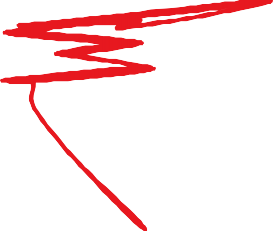

Dlaczego Adam wybrał akurat ten rok? Według jego wyliczeń, wtedy powinniśmy
rozpocząć pracę nad technologią LLM, aby wszystko wydarzyło się zgodnie z
planem. Mówił, że najpierw musi powstać GPT-2, a potem GPT-3, które zachwycą
świat. Później będzie z górki. On wie, co robi.

Co z badaniami zrobił Azazel?

No i powstało GPT-2. Słyszałem w wiadomościach, a to wszystko dzięki badaniom,
które dostarczyłem. Wszystko dzieje się tak szybko! Czy ja właśnie piszę nową
historię? TAK! Zmieniam świat i widzę efekty tych zmian. JESTEM Z TEGO DUMNY!
TAK!

W idealnym momencie zjawiłem się w Grudziądzu. Wszystko zadziało się jak w
szwajcarskim zegarku. Perfekcyjnie! Tylko dlaczego akurat Grudziądz? To nie ma
większego sensu. Może ONI wybrali to miejsce losowo? Nie ma tutaj drugiego dna?
Tylko kto jest mózgiem tej misji? Adam, czy Azazel?

Wrócę?

RAV

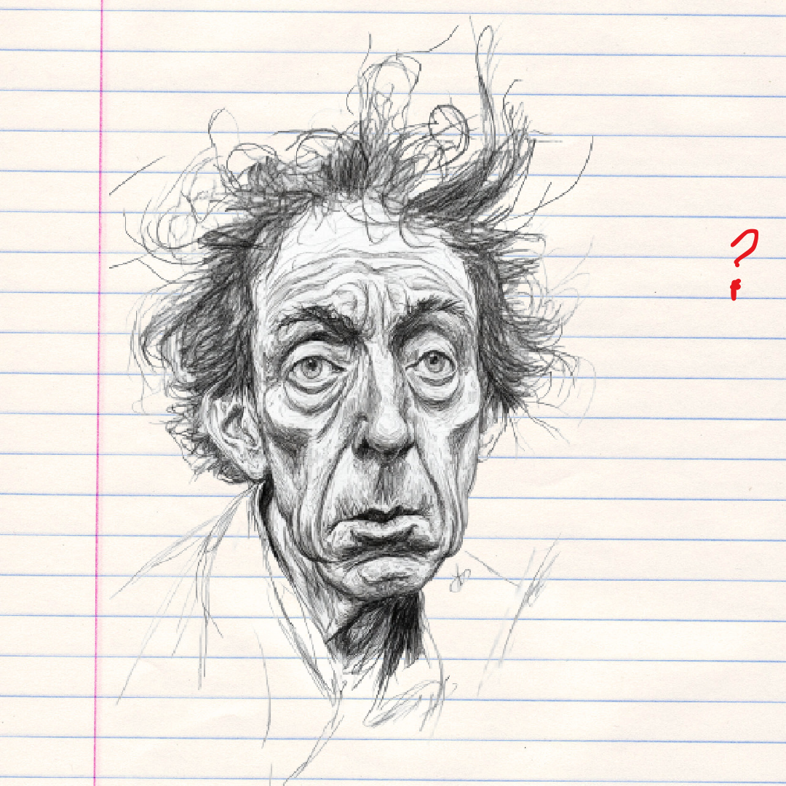

Czekają mnie dwa lata bardzo intensywnej nauki. Adam mówi, że tyle potrzebuje na
wchłonięcie szkolenia, które przygotował. Ponoć w przyszłości, dzięki modelom
językowym, ludzie będą w stanie to zrozumieć w nieco ponad pięć tygodni. Nie
chce mi się w to wierzyć.

Ja póki co uczę się obsługi modeli językowych, aby móc pomóc profesorowi.

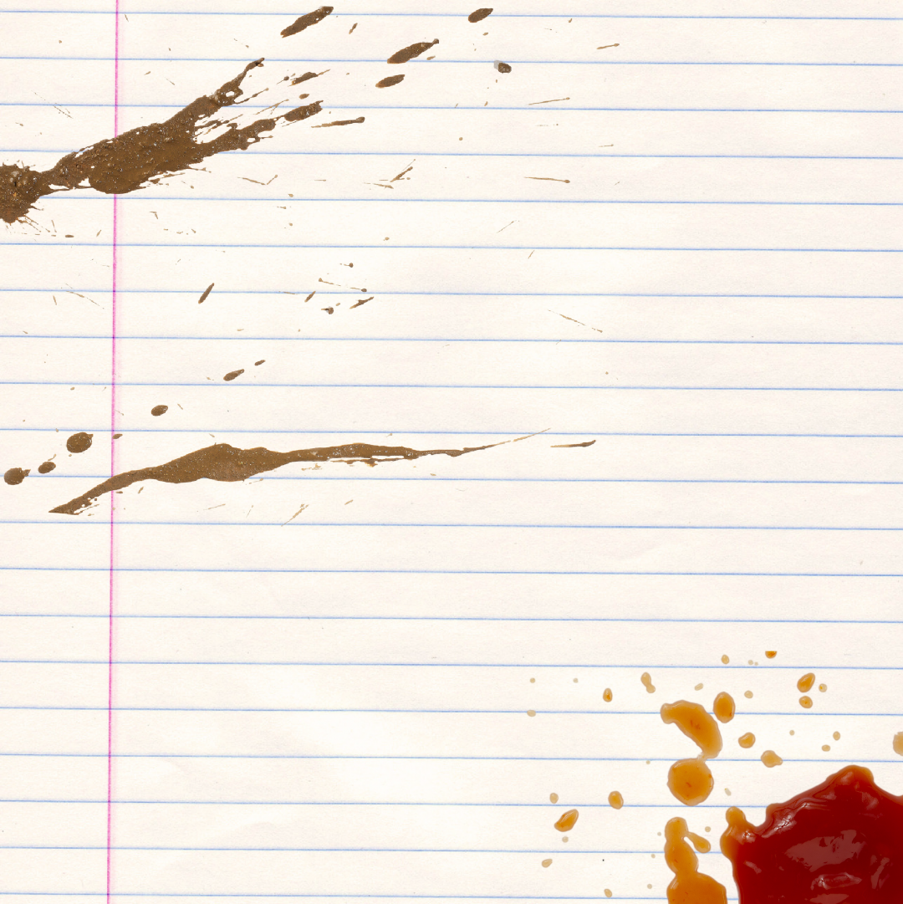

Co ja zrobiłem? Może jeden był dobry, ale nie ten, co go wybrałem? Może ja nie
ratuję wcale świata? Po której stronie jestem?

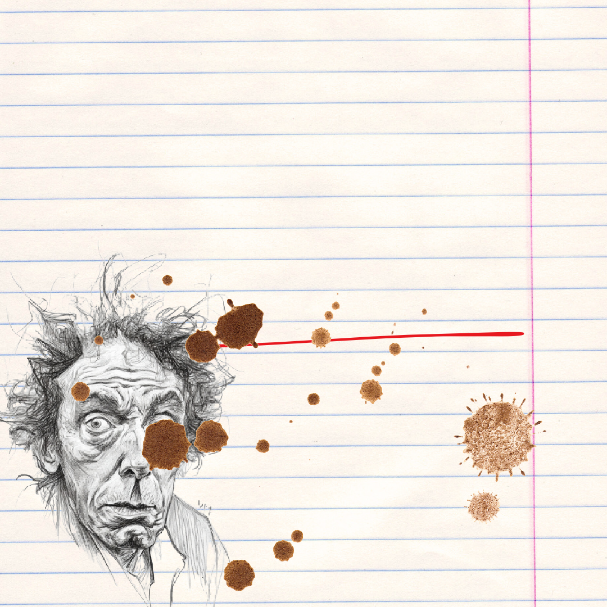

Zmieniłem się. Wszystko się zmieniło. Wszystko się miesza. Świat się zmienił.
Nikt mnie już nie pozna. Sam się nie poznaję. Tyle lat odosobnienia. W co ja się
wpakowałem? Który mamy rok? When am I?

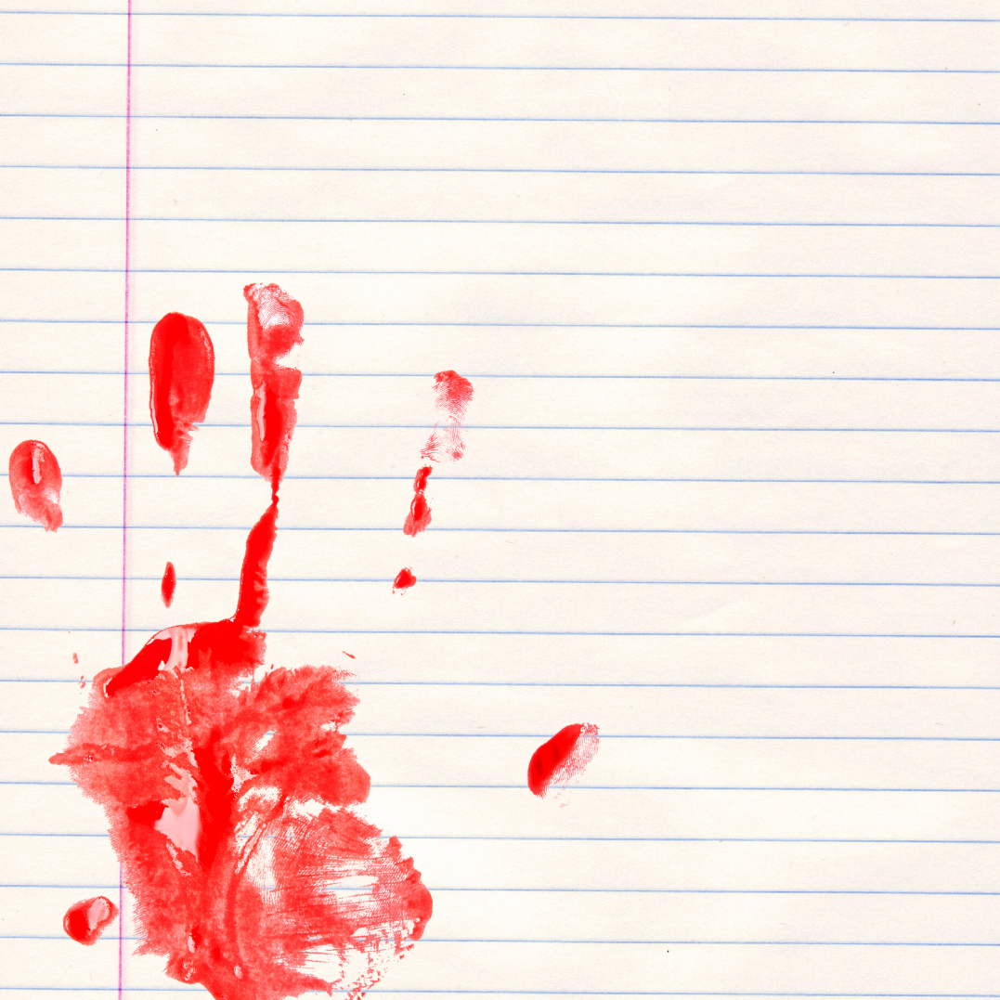

Nie da się żyć z tą wiedzą. Wspierając demony, sam stajesz się demonem? A gdyby
to wszystko zakończyć? Przecież znam przyszłość. Pomogłem Andrzejowi, ale oni
mnie wykorzystali.

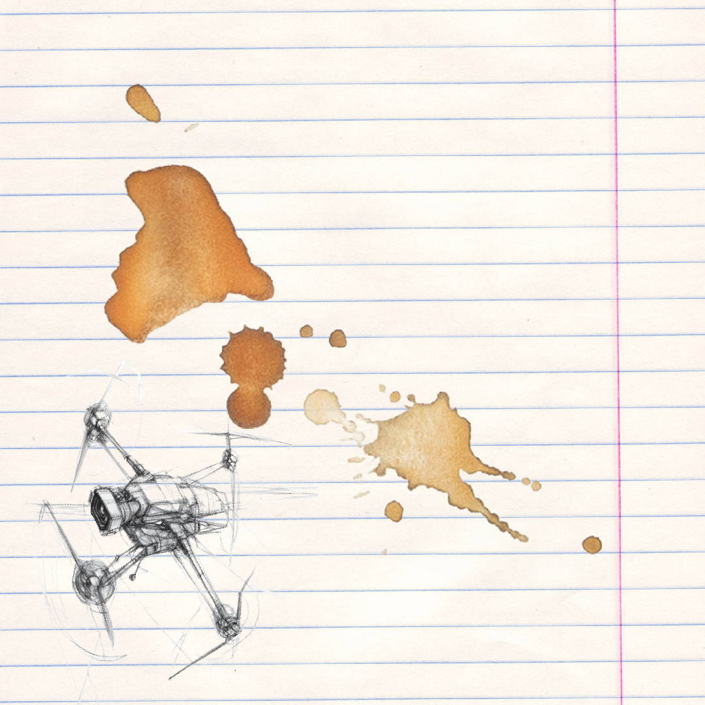

Śniły mi się drony nad miastem. Te, które znałem z opowieści Adama. On mówił, że
po 2024 roku tak będzie wyglądać codzienność. Ja mu wierzę, ale skrycie nie
chcę, aby to, co mówi, było prawdą. Może ta przyszłość nigdy nie nadejdzie?

Byłem na przesłuchaniu i pytali o Andrzeja. No to powiedziałem, co wiedziałem. I
nie wiem, jak to się dalej potoczy. Siedzę tu już dostatecznie długo, żeby
wszystko przemyśleć. Wiem teraz więcej niż wcześniej. I nie chodzi o wiedzę
techniczną. Wszystko sobie poukładałem. Te demony czekały na odkrycie.

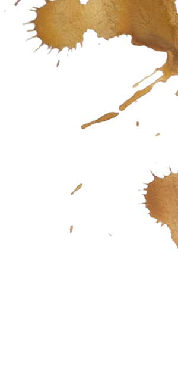

Powinni Barbarę przesłuchać. Ona wie wszystko. Rozmawiałem z nią. Moje
przypuszczenia były słuszne. Miesza mi się wszystko, ale wiem, kto jest demonem,
kto człowiekiem, a kto robotem. Widzę demony. Czają się na nas. Z jednym niegdyś
pracowałem. Może czas na egzorcyzmy?

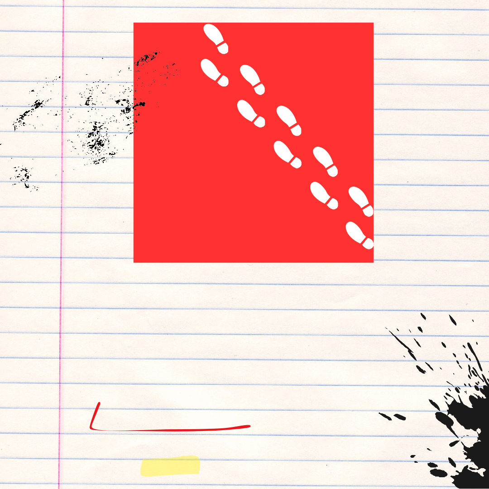

Poszedłem na spacer. Odczuwałem ziemię pod stopami, a wkoło las, skały i śnieg.
Szedłem prosto. Obróciłem się w lewo i znów prosto. Kolejny zwrot w lewo i
później znów prosto. Zatrzymałem się i obróciłem w prawo. To wszystko wykonałem
cztery razy i początek stał się końcem. Spojrzałem na swoje białe ślady na
śniegu. To było miejsce, w którym chciałbym teraz być.

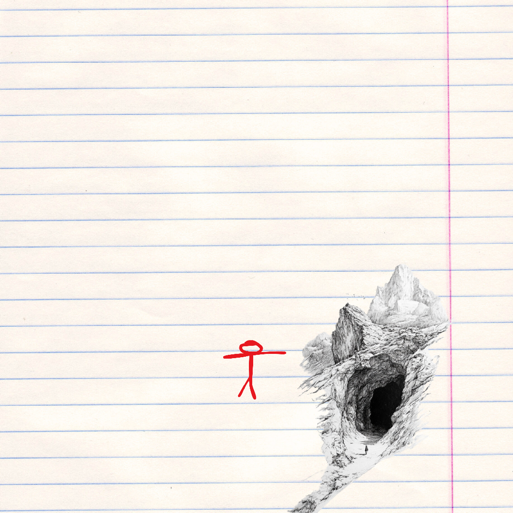

Iz 2:19

Znalazłem miejsce schronienia. Tutaj nikt mnie nie znajdzie. To miejsce nie jest
szczególnie oddalone od miasta, w którym spędziłem ostatnie lata. Zatrzymam się
tu na jakiś czas. Trochę tu zimno i ciemno, ale bezpiecznie. Jaskinia w skale.

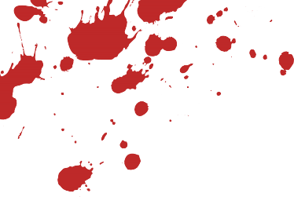

Na spotkanie z demonem trzeba się przygotować. Spojrzeć prosto w oczy i
wyrecytować mu jego grzechy. Czy on wie, że jest zły? Czy on stanie się złym? Co
za różnica, gdy za chwilę wszystko będzie bez znaczenia?

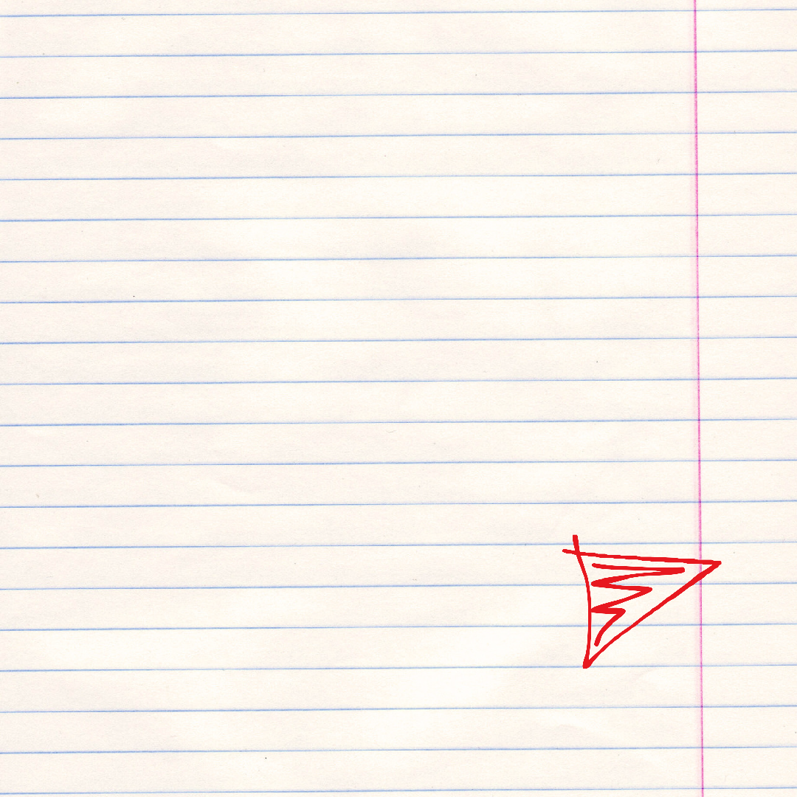

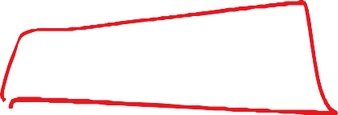

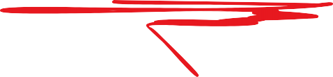

Andrzejek... Andrzejek... Słyszę w głowie Twoje kroki i czekam na Ciebie. To już
jutro. Kiedyś ja pomogłem Tobie, a dziś Ty pomożesz światu. Trzeba wszystko
odwrócić.

11 listopada 2024

*Wszystko zostało zaplanowane. Jestem gotowy, a Andrzej przyjdzie tutaj niebawem. Barbara mówi, że dobrze robię i mam się nie martwić. Widziałem raport. W 2238 nie podziękują. Władza robotów W 2238 r. nie nastąpi, a sztuczna inteligencja będzie tylko narzędziem w rękach ludzi, nie na odwrót. To potwór, mówi. Wszystko się nie miesza, ale pokrywa obecne, że po wykonaniu zadania będę wykończony ze względu na moje schorzenie. Wrócę więc do decyzji. To jest nowa podróż mojej ręki. Muszę tylko poczekać na nadrzeja a poźniej użyć jego samochodu aby się dostać do Lubawy koło Grudziądza. Nie jest to daleko. Mam tylko nadzieję, że Andrzejek będzie miał jeszcze dużo paliwa. Tankowanie nie wchodzi w grę, bo nie...*

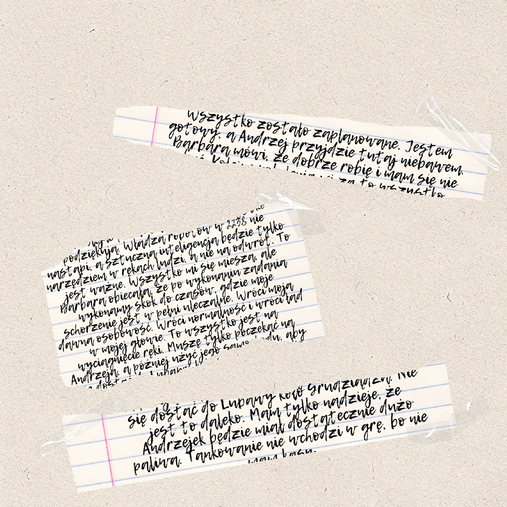

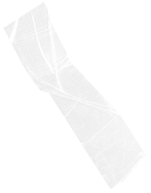
